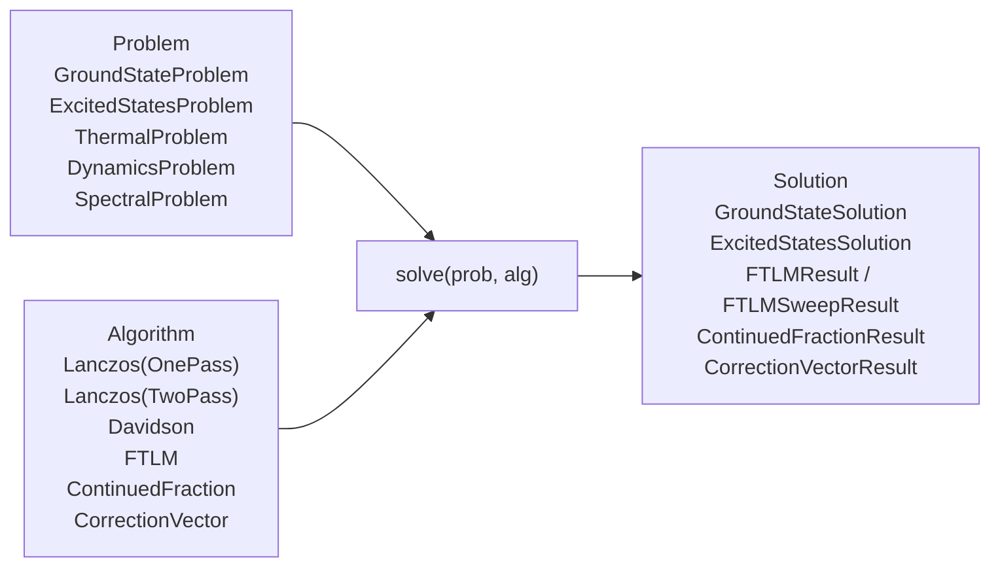

# Comprehensive Julia Developer & API Reference Guide for `QuantumKrylov.jl`

`QuantumKrylov.jl` is the official, high-performance native Julia interface to the `qkrylov` C++20 matrix-free Krylov subspace diagonalization and quantum dynamics engine. It links directly to `libqkrylov.so` via zero-overhead `ccall`, supports dual-precision execution (`Float64` and `Float32`), provides hardware acceleration across multicore CPUs and GPUs, features zero-copy GPU memory management through [`DeviceVector`](file:///home/pritipriya/Documents/GitHub/qkrylov/bindings/julia/src/device.jl#L96-L121), and integrates seamlessly with the **SciML Common Interface** (`solve(prob, alg)`).

---

## Table of Contents

1. [Architectural Overview & Design Principles](#1-architectural-overview--design-principles)
2. [Source Tree Organization & Exports](#2-source-tree-organization--exports)
3. [Installation, Dynamic Linking & Diagnostics](#3-installation-dynamic-linking--diagnostics)
4. [Hardware Devices, Platform Traits & GPU Detection](#4-hardware-devices-platform-traits--gpu-detection)
5. [Device-Resident Memory Management (`DeviceVector`)](#5-device-resident-memory-management-devicevector)
6. [Quantum Number Symmetry & Sectors (`Sector`)](#6-quantum-number-symmetry--sectors-sector)
7. [Physical Site Models & Local Action Evaluation (`AbstractSite`)](#7-physical-site-models--local-action-evaluation-abstractsite)
8. [Hilbert Space Bases & Fock State Indexing (`AbstractBasis`)](#8-hilbert-space-bases--fock-state-indexing-abstractbasis)
9. [Operator Sum Algebra & Symbolic Expressions (`OpSum`)](#9-operator-sum-algebra--symbolic-expressions-opsum)
10. [Matrix-Free Hamiltonian Engine (`MatrixFreeHamiltonian`)](#10-matrix-free-hamiltonian-engine-matrixfreehamiltonian)
11. [Parallel Vector BLAS-1 Kernels](#11-parallel-vector-blas-1-kernels)
12. [SciML Common Interface (`solve(prob, alg)`)](#12-sciml-common-interface-solveprob-alg)
    - [12.1 Problem Hierarchy (`AbstractQuantumProblem`)](#121-problem-hierarchy-abstractquantumproblem)
    - [12.2 Algorithm Hierarchy (`AbstractQuantumAlgorithm`)](#122-algorithm-hierarchy-abstractquantumalgorithm)
    - [12.3 Solution Protocol (`AbstractQuantumSolution`)](#123-solution-protocol-abstractquantumsolution)
13. [Classical Eigensolvers & Dynamics Functions](#13-classical-eigensolvers--dynamics-functions)
    - [13.1 Lanczos Solvers (Single-Pass, Two-Pass & DGKS)](#131-lanczos-solvers-single-pass-two-pass--dgks)
    - [13.2 Block Davidson Solver](#132-block-davidson-solver)
    - [13.3 Continued Fraction Dynamical Green's Functions](#133-continued-fraction-dynamical-greens-functions)
    - [13.4 Finite-Temperature Lanczos Method (Dual Workflows: Streamed & Cached)](#134-finite-temperature-lanczos-method-dual-workflows-streamed--cached)
    - [13.5 Pure-State Real-Time Dynamics (time_evolve)](#135-pure-state-real-time-dynamics-time_evolve)
    - [13.6 Finite-Temperature Dynamical Correlators (ftlm_dynamics)](#136-finite-temperature-dynamical-correlators-ftlm_dynamics)
    - [13.7 Correction Vector Method (Spectroscopy)](#137-correction-vector-method-spectroscopy)
14. [Comprehensive End-to-End Julia Usage Examples](#14-comprehensive-end-to-end-julia-usage-examples)

---

## 1. Architectural Overview & Design Principles

### 1.1 Pure Native `ccall` Wrapper
`QuantumKrylov.jl` binds directly to `libqkrylov.so` using Julia's native `ccall` mechanism. It requires **no CxxWrap.jl, no intermediate C++ compiler, and no external runtime bridge**, delivering maximum performance with near-zero function call overhead.

### 1.2 Dual-Precision Dispatch (`Float64` & `Float32`)
Scientific simulations balance numerical precision against GPU hardware capabilities:
* **`Float64` (Double Precision)**: Standard for CPU multi-threading and datacenter GPUs (NVIDIA A100/H100), ensuring convergence down to machine precision ($\approx 10^{-12}\text{--}10^{-15}$).
* **`Float32` (Single Precision)**: Standard for consumer GPUs (NVIDIA GeForce RTX) to avoid the 1/32–1/64 FP64 hardware throttle and reduce VRAM by 50%, enabling twice as large Hilbert spaces ($D = 2^N$) to fit in memory.

In `QuantumKrylov.jl`, [`MatrixFreeHamiltonian`](file:///home/pritipriya/Documents/GitHub/qkrylov/bindings/julia/src/hamiltonian.jl#L3-L74) and [`DeviceVector`](file:///home/pritipriya/Documents/GitHub/qkrylov/bindings/julia/src/device.jl#L96-L121) are parameterized by precision:
```julia
H_f64 = MatrixFreeHamiltonian{Float64}(basis, ops) # Explicit Float64
H_f32 = MatrixFreeHamiltonian{Float32}(basis, ops) # Explicit Float32
```
When omitted, `MatrixFreeHamiltonian` dynamically defaults to `Float32` if a GPU device is targeted, and `Float64` if targeting the CPU.

### 1.3 Automatic Resource Management via GC Finalizers
All underlying C++ objects (sectors, bases, sites, operator sums, Hamiltonians, and device memory allocations) are wrapped inside mutable Julia structs with automatic garbage-collection `finalizer`s:
```julia
obj = new(ptr)
finalizer(obj) do o
    if o.ptr != C_NULL
        ccall((:qkrylov_basis_destroy, libqkrylov), Cvoid, (Ptr{Cvoid},), o.ptr)
        o.ptr = C_NULL
    end
end
```
Users never have to manually free pointers.

---

## 2. Source Tree Organization & Exports

All source files reside in [`bindings/julia/src/`](file:///home/pritipriya/Documents/GitHub/qkrylov/bindings/julia/src):

```text
bindings/julia/
├── Project.toml               # Package dependencies (Libdl, qkrylov_jll, Test)
├── src/
│   ├── QuantumKrylov.jl       # Main module entry point & export catalog
│   ├── libqkrylov.jl          # Shared library resolution & error checking
│   ├── device.jl              # Hardware device traits & DeviceVector implementation
│   ├── sector.jl              # Sector symmetry wrapper & mutators
│   ├── site.jl                # Site types, local action, and apply()
│   ├── basis.jl               # Hilbert space bases & indexing lookups
│   ├── opsum.jl               # OpSum symbolic algebra, generators, and validation
│   ├── hamiltonian.jl         # MatrixFreeHamiltonian, site auto-inference & SpMV
│   ├── solvers.jl             # SciML solve() interface, Lanczos, Davidson, FTLM
│   └── vector_ops.jl          # Accelerated Kokkos BLAS-1 vector operations
└── test/
    └── runtests.jl            # Comprehensive test suite
```

### Exported Symbols Catalog
Defined in [`bindings/julia/src/QuantumKrylov.jl`](file:///home/pritipriya/Documents/GitHub/qkrylov/bindings/julia/src/QuantumKrylov.jl#L17-L40):

* **Sectors**: [`Sector`](file:///home/pritipriya/Documents/GitHub/qkrylov/bindings/julia/src/sector.jl#L3-L31), [`set_sz!`](file:///home/pritipriya/Documents/GitHub/qkrylov/bindings/julia/src/sector.jl#L33-L37), [`set_hubbard_particles!`](file:///home/pritipriya/Documents/GitHub/qkrylov/bindings/julia/src/sector.jl#L39-L43), [`set_n!`](file:///home/pritipriya/Documents/GitHub/qkrylov/bindings/julia/src/sector.jl#L45-L49), [`set_nb!`](file:///home/pritipriya/Documents/GitHub/qkrylov/bindings/julia/src/sector.jl#L51-L55), [`get_sz`](file:///home/pritipriya/Documents/GitHub/qkrylov/bindings/julia/src/sector.jl#L57-L63), [`get_hubbard_particles`](file:///home/pritipriya/Documents/GitHub/qkrylov/bindings/julia/src/sector.jl#L65-L72), [`get_n`](file:///home/pritipriya/Documents/GitHub/qkrylov/bindings/julia/src/sector.jl#L74-L80), [`get_nb`](file:///home/pritipriya/Documents/GitHub/qkrylov/bindings/julia/src/sector.jl#L82-L88).
* **Sites**: [`AbstractSite`](file:///home/pritipriya/Documents/GitHub/qkrylov/bindings/julia/src/site.jl#L3), [`SpinHalfSite`](file:///home/pritipriya/Documents/GitHub/qkrylov/bindings/julia/src/site.jl#L5-L20), [`SpinSSite`](file:///home/pritipriya/Documents/GitHub/qkrylov/bindings/julia/src/site.jl#L73-L89), [`FermionSite`](file:///home/pritipriya/Documents/GitHub/qkrylov/bindings/julia/src/site.jl#L22-L37), [`HubbardSite`](file:///home/pritipriya/Documents/GitHub/qkrylov/bindings/julia/src/site.jl#L39-L54), [`TJSite`](file:///home/pritipriya/Documents/GitHub/qkrylov/bindings/julia/src/site.jl#L56-L71), [`LocalAction`](file:///home/pritipriya/Documents/GitHub/qkrylov/bindings/julia/src/site.jl#L97-L101), [`apply`](file:///home/pritipriya/Documents/GitHub/qkrylov/bindings/julia/src/site.jl#L103-L114), [`site_type`](file:///home/pritipriya/Documents/GitHub/qkrylov/bindings/julia/src/site.jl#L130-L141).
* **Bases**: [`AbstractBasis`](file:///home/pritipriya/Documents/GitHub/qkrylov/bindings/julia/src/basis.jl#L3), [`SpinHalfBasis`](file:///home/pritipriya/Documents/GitHub/qkrylov/bindings/julia/src/basis.jl#L63-L85), [`SpinSBasis`](file:///home/pritipriya/Documents/GitHub/qkrylov/bindings/julia/src/basis.jl#L87-L115), [`FermionBasis`](file:///home/pritipriya/Documents/GitHub/qkrylov/bindings/julia/src/basis.jl#L117-L139), [`HubbardBasis`](file:///home/pritipriya/Documents/GitHub/qkrylov/bindings/julia/src/basis.jl#L141-L163), [`TJBasis`](file:///home/pritipriya/Documents/GitHub/qkrylov/bindings/julia/src/basis.jl#L165-L187), [`dimension`](file:///home/pritipriya/Documents/GitHub/qkrylov/bindings/julia/src/basis.jl#L5-L7), [`nsites`](file:///home/pritipriya/Documents/GitHub/qkrylov/bindings/julia/src/basis.jl#L9-L11), [`state`](file:///home/pritipriya/Documents/GitHub/qkrylov/bindings/julia/src/basis.jl#L13-L15), [`basis_index`](file:///home/pritipriya/Documents/GitHub/qkrylov/bindings/julia/src/basis.jl#L17-L19), [`basis_type`](file:///home/pritipriya/Documents/GitHub/qkrylov/bindings/julia/src/basis.jl#L44-L55), [`sector`](file:///home/pritipriya/Documents/GitHub/qkrylov/bindings/julia/src/basis.jl#L57-L61), [`spin`](file:///home/pritipriya/Documents/GitHub/qkrylov/bindings/julia/src/basis.jl#L30-L35), [`dimension_per_site`](file:///home/pritipriya/Documents/GitHub/qkrylov/bindings/julia/src/basis.jl#L37-L42).
* **Operators & OpSum**: [`OpSum`](file:///home/pritipriya/Documents/GitHub/qkrylov/bindings/julia/src/opsum.jl#L12-L28), [`add_term!`](file:///home/pritipriya/Documents/GitHub/qkrylov/bindings/julia/src/opsum.jl#L77-L128), [`clear!`](file:///home/pritipriya/Documents/GitHub/qkrylov/bindings/julia/src/opsum.jl#L70-L75), [`OpTerm`](file:///home/pritipriya/Documents/GitHub/qkrylov/bindings/julia/src/opsum.jl#L3-L6), [`OpExpr`](file:///home/pritipriya/Documents/GitHub/qkrylov/bindings/julia/src/opsum.jl#L8-L10), [`validate`](file:///home/pritipriya/Documents/GitHub/qkrylov/bindings/julia/src/opsum.jl#L251-L264), [`validate!`](file:///home/pritipriya/Documents/GitHub/qkrylov/bindings/julia/src/opsum.jl#L266-L273).
* **Algebraic Generators**: `Sz`, `Sp`, `Sm`, `Sx`, `Sy`, `n`, `c`, `cdag`, `CdagUp`, `CUp`, `CdagDn`, `CDn`, `Nup`, `Ndn`, `Nupdn`, `Bdag`, `B`, `N`.
* **Hamiltonians**: [`MatrixFreeHamiltonian`](file:///home/pritipriya/Documents/GitHub/qkrylov/bindings/julia/src/hamiltonian.jl#L3-L74), [`diagonal`](file:///home/pritipriya/Documents/GitHub/qkrylov/bindings/julia/src/hamiltonian.jl#L159-L189), [`diagonal_device`](file:///home/pritipriya/Documents/GitHub/qkrylov/bindings/julia/src/hamiltonian.jl#L214-L229).
* **Device Vectors**: [`DeviceVector`](file:///home/pritipriya/Documents/GitHub/qkrylov/bindings/julia/src/device.jl#L96-L121), [`mul!`](file:///home/pritipriya/Documents/GitHub/qkrylov/bindings/julia/src/hamiltonian.jl#L192-L206).
* **SciML Common Interface**: [`solve`](file:///home/pritipriya/Documents/GitHub/qkrylov/bindings/julia/src/solvers.jl#L245-L290), [`GroundStateProblem`](file:///home/pritipriya/Documents/GitHub/qkrylov/bindings/julia/src/solvers.jl#L6-L8), [`ExcitedStatesProblem`](file:///home/pritipriya/Documents/GitHub/qkrylov/bindings/julia/src/solvers.jl#L10-L14), [`ThermalProblem`](file:///home/pritipriya/Documents/GitHub/qkrylov/bindings/julia/src/solvers.jl#L16-L24), [`DynamicsProblem`](file:///home/pritipriya/Documents/GitHub/qkrylov/bindings/julia/src/solvers.jl#L38-L41), [`SpectralProblem`](file:///home/pritipriya/Documents/GitHub/qkrylov/bindings/julia/src/solvers.jl#L43-L49), [`Lanczos`](file:///home/pritipriya/Documents/GitHub/qkrylov/bindings/julia/src/solvers.jl#L58-L73), [`OnePass`](file:///home/pritipriya/Documents/GitHub/qkrylov/bindings/julia/src/solvers.jl#L55), [`TwoPass`](file:///home/pritipriya/Documents/GitHub/qkrylov/bindings/julia/src/solvers.jl#L56), [`OnePass_DKGS`](file:///home/pritipriya/Documents/GitHub/qkrylov/bindings/julia/src/solvers.jl#L59), [`Davidson`](file:///home/pritipriya/Documents/GitHub/qkrylov/bindings/julia/src/solvers.jl#L75-L82), [`FTLM`](file:///home/pritipriya/Documents/GitHub/qkrylov/bindings/julia/src/solvers.jl#L84-L93), [`FTLMSamples`](file:///home/pritipriya/Documents/GitHub/qkrylov/bindings/julia/src/solvers.jl#L934), [`ContinuedFraction`](file:///home/pritipriya/Documents/GitHub/qkrylov/bindings/julia/src/solvers.jl#L95-L98), [`CorrectionVector`](file:///home/pritipriya/Documents/GitHub/qkrylov/bindings/julia/src/solvers.jl#L100-L109), [`GroundStateSolution`](file:///home/pritipriya/Documents/GitHub/qkrylov/bindings/julia/src/solvers.jl#L185-L200), [`LanczosResult`](file:///home/pritipriya/Documents/GitHub/qkrylov/bindings/julia/src/solvers.jl#L201-L204), [`ExcitedStatesSolution`](file:///home/pritipriya/Documents/GitHub/qkrylov/bindings/julia/src/solvers.jl#L484-L498).
* **Solvers (Direct Wrappers)**: [`lanczos_ground_state`](file:///home/pritipriya/Documents/GitHub/qkrylov/bindings/julia/src/solvers.jl#L765-L777), [`lanczos_lowest`](file:///home/pritipriya/Documents/GitHub/qkrylov/bindings/julia/src/solvers.jl#L779-L814), [`davidson_lowest`](file:///home/pritipriya/Documents/GitHub/qkrylov/bindings/julia/src/solvers.jl#L816-L832), [`continued_fraction_coeffs`](file:///home/pritipriya/Documents/GitHub/qkrylov/bindings/julia/src/solvers.jl#L834-L860), [`evaluate_spectral_function`](file:///home/pritipriya/Documents/GitHub/qkrylov/bindings/julia/src/solvers.jl#L862-L879), [`ftlm`](file:///home/pritipriya/Documents/GitHub/qkrylov/bindings/julia/src/solvers.jl#L881-L904), [`ftlm_sweep`](file:///home/pritipriya/Documents/GitHub/qkrylov/bindings/julia/src/solvers.jl#L906-L945), [`ftlm_sample`](file:///home/pritipriya/Documents/GitHub/qkrylov/bindings/julia/src/solvers.jl#L959-L998), [`ftlm_evaluate_sweep`](file:///home/pritipriya/Documents/GitHub/qkrylov/bindings/julia/src/solvers.jl#L1006-L1086), [`solver_correction_vector`](file:///home/pritipriya/Documents/GitHub/qkrylov/bindings/julia/src/solvers.jl#L947-L974).
* **Vector BLAS-1**: [`vector_dot`](file:///home/pritipriya/Documents/GitHub/qkrylov/bindings/julia/src/vector_ops.jl#L8-L31), [`vector_norm`](file:///home/pritipriya/Documents/GitHub/qkrylov/bindings/julia/src/vector_ops.jl#L38-L58), [`vector_axpy!`](file:///home/pritipriya/Documents/GitHub/qkrylov/bindings/julia/src/vector_ops.jl#L65-L86), [`vector_scal!`](file:///home/pritipriya/Documents/GitHub/qkrylov/bindings/julia/src/vector_ops.jl#L93-L112), [`vector_normalize!`](file:///home/pritipriya/Documents/GitHub/qkrylov/bindings/julia/src/vector_ops.jl#L119-L137), [`vector_zero_fill!`](file:///home/pritipriya/Documents/GitHub/qkrylov/bindings/julia/src/vector_ops.jl#L144-L162), [`vector_copy!`](file:///home/pritipriya/Documents/GitHub/qkrylov/bindings/julia/src/vector_ops.jl#L169-L189).
* **Hardware Devices**: [`AbstractDevice`](file:///home/pritipriya/Documents/GitHub/qkrylov/bindings/julia/src/device.jl#L5), [`CPUDevice`](file:///home/pritipriya/Documents/GitHub/qkrylov/bindings/julia/src/device.jl#L6), [`CUDADevice`](file:///home/pritipriya/Documents/GitHub/qkrylov/bindings/julia/src/device.jl#L7), [`HIPDevice`](file:///home/pritipriya/Documents/GitHub/qkrylov/bindings/julia/src/device.jl#L8), [`SYCLDevice`](file:///home/pritipriya/Documents/GitHub/qkrylov/bindings/julia/src/device.jl#L9), [`find_gpu`](file:///home/pritipriya/Documents/GitHub/qkrylov/bindings/julia/src/device.jl#L52-L58), [`gpu_count`](file:///home/pritipriya/Documents/GitHub/qkrylov/bindings/julia/src/device.jl#L66-L71), [`is_gpu_build`](file:///home/pritipriya/Documents/GitHub/qkrylov/bindings/julia/src/device.jl#L39-L44), [`initialize_device!`](file:///home/pritipriya/Documents/GitHub/qkrylov/bindings/julia/src/device.jl#L78-L85).
* **Diagnostics**: [`get_last_error_message`](file:///home/pritipriya/Documents/GitHub/qkrylov/bindings/julia/src/libqkrylov.jl#L36-L39), [`clear_last_error`](file:///home/pritipriya/Documents/GitHub/qkrylov/bindings/julia/src/libqkrylov.jl#L46-L48).

---

## 3. Installation, Dynamic Linking & Diagnostics

### 3.1 Dynamic Library Search Order
In [`bindings/julia/src/libqkrylov.jl`](file:///home/pritipriya/Documents/GitHub/qkrylov/bindings/julia/src/libqkrylov.jl#L61-L110), `libqkrylov.so` is located via this priority chain:
1. `ENV["QKRYLOV_LIB_PATH"]`: Explicit override to any compiled `.so`, `.dylib`, or `.dll`.
2. Relative build paths: `../../build/libqkrylov.so` (detects local repository builds automatically).
3. `qkrylov_jll`: Pre-compiled binary artifact managed by Julia Pkg.
4. System library loader paths (`Libdl`).

### 3.2 Error Diagnostics & Exception Barriers
Every C ABI call checks its return code. If non-zero, [`_check_status`](file:///home/pritipriya/Documents/GitHub/qkrylov/bindings/julia/src/libqkrylov.jl#L50-L59) retrieves the thread-local error message from C++ and throws an informative Julia `ErrorException`:

```julia
# Manual diagnostic querying
msg = get_last_error_message()
clear_last_error()
```

---

## 4. Hardware Devices, Platform Traits & GPU Detection

Defined in [`bindings/julia/src/device.jl`](file:///home/pritipriya/Documents/GitHub/qkrylov/bindings/julia/src/device.jl#L4-L85):

### 4.1 Device Traits
```julia
abstract type AbstractDevice end
struct CPUDevice   <: AbstractDevice end
struct CUDADevice  <: AbstractDevice end
struct HIPDevice   <: AbstractDevice end
struct SYCLDevice  <: AbstractDevice end
```

Devices can be passed directly to `MatrixFreeHamiltonian`:
```julia
H = MatrixFreeHamiltonian(basis, ops; device=CPUDevice())
H = MatrixFreeHamiltonian(basis, ops; device=CUDADevice())
```

### 4.2 Platform Queries
```julia
is_gpu = is_gpu_build()   # Returns true if compiled with CUDA/HIP/SYCL
backend = find_gpu()      # Returns "cuda", "hip", "sycl", or nothing
count = gpu_count()       # Number of physical GPUs detected
initialize_device!("cuda:0")
```

---

## 5. Device-Resident Memory Management (`DeviceVector`)

Defined in [`bindings/julia/src/device.jl`](file:///home/pritipriya/Documents/GitHub/qkrylov/bindings/julia/src/device.jl#L96-L218):

[`DeviceVector{T}`](file:///home/pritipriya/Documents/GitHub/qkrylov/bindings/julia/src/device.jl#L96-L121) is an opaque handle to GPU VRAM (or Kokkos device allocations). It allows zero-copy matrix-vector multiplication (`y_dev = H * x_dev`) and pure device BLAS-1 operations without CPU host memory transfers.

### 5.1 Construction & Transfers
```julia
# 1. Allocate uninitialized device vector of dimension D
v_dev = DeviceVector{Float64}(1000)

# 2. Stage host array -> device vector (deep copy)
psi_host = rand(ComplexF64, 1000)
v_dev = DeviceVector(psi_host) # auto-allocates and copies

# 3. Update existing device vector from host
copyto!(v_dev, psi_host)

# 4. Fetch device vector -> host array (deep copy)
psi_back = Vector(v_dev) # returns Vector{ComplexF64}
```

### 5.2 Zero-Copy GPU SpMV
```julia
# Allocating multiplication:
y_dev = H * x_dev # returns a new DeviceVector

# In-place zero-allocation multiplication:
mul!(y_dev, H, x_dev)
```

---

## 6. Quantum Number Symmetry & Sectors (`Sector`)

Defined in [`bindings/julia/src/sector.jl`](file:///home/pritipriya/Documents/GitHub/qkrylov/bindings/julia/src/sector.jl#L3-L107):

```julia
sec = Sector() # Unconstrained sector

# Total Sz conservation (2 * Sz)
set_sz!(sec, 0)     # Sz = 0
set_sz!(sec, 1)     # Sz = +1/2

# Hubbard (N_up, N_down) electron numbers
set_hubbard_particles!(sec, 2, 2) # 2 up, 2 down

# Spinless fermion particle count
set_n!(sec, 4)

# Boson particle count
set_nb!(sec, 2)

# Query constraints (returns Int or nothing)
get_sz(sec)               # returns 0
get_hubbard_particles(sec) # returns (2, 2)
```

---

## 7. Physical Site Models & Local Action Evaluation (`AbstractSite`)

Defined in [`bindings/julia/src/site.jl`](file:///home/pritipriya/Documents/GitHub/qkrylov/bindings/julia/src/site.jl#L3-L141):

### 7.1 Available Site Models
* [`SpinHalfSite()`](file:///home/pritipriya/Documents/GitHub/qkrylov/bindings/julia/src/site.jl#L5-L20): Spin-$1/2$ ($d=2$, $|\uparrow\rangle, |\downarrow\rangle$). Operators: `"Sz"`, `"Sp"`, `"Sm"`, `"Sx"`, `"Sy"`.
* [`SpinSSite(S)`](file:///home/pritipriya/Documents/GitHub/qkrylov/bindings/julia/src/site.jl#L73-L89): Arbitrary spin $S$ ($d=2S+1$).
* [`FermionSite()`](file:///home/pritipriya/Documents/GitHub/qkrylov/bindings/julia/src/site.jl#L22-L37): Spinless fermions ($d=2$). Operators: `"N"`, `"Id"`, `"C"`, `"Cdag"`. Tracks Jordan-Wigner phase $(-1)^{\sum_{j<i} n_j}$.
* [`HubbardSite()`](file:///home/pritipriya/Documents/GitHub/qkrylov/bindings/julia/src/site.jl#L39-L54): Spinful electrons ($d=4$, empty, $\uparrow$, $\downarrow$, $\uparrow\downarrow$). Operators: `"Nup"`, `"Ndn"`, `"Nupdn"`, `"CUp"`, `"CdagUp"`, `"CDn"`, `"CdagDn"`.
* [`TJSite()`](file:///home/pritipriya/Documents/GitHub/qkrylov/bindings/julia/src/site.jl#L56-L71): $t\text{-}J$ electrons ($d=3$). Double-occupancy creation is forbidden.

### 7.2 Site Reflection & Local Action (`apply`)
```julia
site = SpinHalfSite()
spin(site)               # 0.5
dimension_per_site(site) # 2
site_type(site)          # :SpinHalf

# Apply operator to a Fock bitstring state
# apply(site, op, site_idx, state_bitstring) -> LocalAction
action = apply(site, "Sz", 0, UInt64(1)) # Sz on site 0 for state |1> (up)
action.valid          # true
action.new_state      # UInt64(1)
action.matrix_element # ComplexF64(0.5, 0.0)
```

---

## 8. Hilbert Space Bases & Fock State Indexing (`AbstractBasis`)

Defined in [`bindings/julia/src/basis.jl`](file:///home/pritipriya/Documents/GitHub/qkrylov/bindings/julia/src/basis.jl#L3-L199):

### 8.1 Concrete Basis Constructors
```julia
# 1. Spin-1/2 basis with Sz keyword shortcut
b_spin = SpinHalfBasis(12; sz=0) # Total Sz = 0

# 2. General Spin-S basis (e.g. S=1 Haldane chain)
b_spin1 = SpinSBasis(6, 1.0; sz=0)

# 3. Spinless Fermion basis with particle number constraint
b_fermion = FermionBasis(10; n=5)

# 4. Fermi-Hubbard basis with spin-resolved electron numbers
b_hubbard = HubbardBasis(4; nup=2, ndn=2)

# 5. t-J basis with no double-occupancy
b_tj = TJBasis(4; nup=1, ndn=1)
```

### 8.2 Basis Methods & Indexing
```julia
dim = dimension(b_spin)   # Hilbert space dimension D
n   = nsites(b_spin)      # Number of lattice sites N
s   = state(b_spin, 0)    # 0-indexed Fock bitstring lookup
idx = basis_index(b_spin, s) # Reverse lookup from bitstring to index
s_in = UInt64(0) in b_spin # Membership test
b_spin[1]                 # 1-indexed Julia getindex
```

---

## 9. Operator Sum Algebra & Symbolic Expressions (`OpSum`)

Defined in [`bindings/julia/src/opsum.jl`](file:///home/pritipriya/Documents/GitHub/qkrylov/bindings/julia/src/opsum.jl#L3-L274):

`QuantumKrylov.jl` provides an embedded algebraic DSL allowing Hamiltonians to be expressed directly in standard mathematical physics notation.

### 9.1 Algebraic Operator Generators
* **Spin**: `Sz(i)`, `Sp(i)`, `Sm(i)`, `Sx(i)`, `Sy(i)`
* **Spinless Fermions**: `n(i)`, `c(i)`, `cdag(i)`
* **Hubbard Electrons**: `CdagUp(i)`, `CUp(i)`, `CdagDn(i)`, `CDn(i)`, `Nup(i)`, `Ndn(i)`, `Nupdn(i)`
* **Bosons**: `Bdag(i)`, `B(i)`, `N(i)`

### 9.2 Building Hamiltonians with Operator Overloads
```julia
ops = OpSum()

# 1D Heisenberg Model
for i in 0:N-2
    ops += 1.0 * Sz(i) * Sz(i+1) + 0.5 * Sp(i) * Sm(i+1) + 0.5 * Sm(i) * Sp(i+1)
end

# Transverse Field
for i in 0:N-1
    ops += -0.5 * Sx(i)
end
```

### 9.3 Low-Level Adders & Introspection
```julia
add_term!(ops, 1.0, "Sz", 0, "Sz", 1)           # 2-body
add_term!(ops, 0.25, ["Sz", "Sz", "Sz"], [0, 1, 2]) # 3-body / n-body

opsum_size(ops) # Number of terms
term_coeff, num_factors = opsum_get_term_info(ops, 0)
op_name, site = opsum_get_factor(ops, 0, 0)

# Validation against system size
valid, errors = validate(ops, N)
validate!(ops, N) # Throws ArgumentError if site indices exceed valid range
```

---

## 10. Matrix-Free Hamiltonian Engine (`MatrixFreeHamiltonian`)

Defined in [`bindings/julia/src/hamiltonian.jl`](file:///home/pritipriya/Documents/GitHub/qkrylov/bindings/julia/src/hamiltonian.jl#L3-L235):

### 10.1 Automatic Site Inference
When constructing a Hamiltonian, specifying the physical site is optional. `MatrixFreeHamiltonian` automatically deduces the physical site model from the basis:
```julia
# Site inferred automatically:
H = MatrixFreeHamiltonian(basis, ops)

# Explicit site specification:
H = MatrixFreeHamiltonian(basis, SpinHalfSite(), ops)
```

### 10.2 Construction Parameters
```julia
H = MatrixFreeHamiltonian(
    basis, ops;
    device = CPUDevice(),     # CPUDevice(), CUDADevice(), HIPDevice(), or SYCLDevice()
    precision = Float64       # Float64 or Float32 (defaults to Float32 on GPU)
)
```

### 10.3 Methods & Matrix Multiplication
```julia
dim = dimension(H)
size(H) # (dim, dim)

# Standard zero-copy matrix-vector multiplication (calls optimized C++ SpMV):
y = H * x # x can be Vector{ComplexF64} or Vector{ComplexF32}

# Extract diagonal entries D_jj = <j|H|j>
diag_host = diagonal(H)        # Vector{Float64}
diag_dev  = diagonal_device(H) # DeviceVector{Float64}
```

---

## 11. Parallel Vector BLAS-1 Kernels

Defined in [`bindings/julia/src/vector_ops.jl`](file:///home/pritipriya/Documents/GitHub/qkrylov/bindings/julia/src/vector_ops.jl#L1-L294):

All vector operations dispatch to parallel Kokkos kernels on the CPU or GPU without allocating temporary arrays:

| Operation | Host Signature (`Vector{Complex{T}}`) | Device Signature (`DeviceVector{T}`) | Description |
| :--- | :--- | :--- | :--- |
| **Inner Product** | `vector_dot(x, y)` | `vector_dot(x_dev, y_dev)` | $\langle x | y \rangle = \sum_i x_i^* y_i$ |
| **2-Norm** | `vector_norm(x)` | `vector_norm(x_dev)` | $\|x\| = \sqrt{\langle x | x \rangle}$ |
| **AXPY** | `vector_axpy!(a, x, y)` | `vector_axpy!(a, x_dev, y_dev)` | $y \leftarrow a \cdot x + y$ |
| **Scale** | `vector_scal!(a, x)` | `vector_scal!(a, x_dev)` | $x \leftarrow a \cdot x$ |
| **Normalize** | `vector_normalize!(x)` | `vector_normalize!(x_dev)` | $x \leftarrow x / \|x\|$ |
| **Zero Fill** | `vector_zero_fill!(x)` | `vector_zero_fill!(x_dev)` | $x \leftarrow 0$ |
| **Deep Copy** | `vector_copy!(dst, src)` | `vector_copy!(dst_dev, src_dev)` | Parallel deep copy |

---

## 12. SciML Common Interface (`solve(prob, alg)`)

Defined in [`bindings/julia/src/solvers.jl`](file:///home/pritipriya/Documents/GitHub/qkrylov/bindings/julia/src/solvers.jl#L4-L763):

`QuantumKrylov.jl` adheres to the unified Julia SciML Problem/Algorithm/Solution interface.



### 12.1 Problem Hierarchy (`AbstractQuantumProblem`)
* [`GroundStateProblem(H)`](file:///home/pritipriya/Documents/GitHub/qkrylov/bindings/julia/src/solvers.jl#L6-L8): Targets ground state eigenvalue and eigenvector.
* [`ExcitedStatesProblem(H; n_eig=1)`](file:///home/pritipriya/Documents/GitHub/qkrylov/bindings/julia/src/solvers.jl#L10-L15): Targets the $k$ lowest eigenpairs.
* [`ThermalProblem(H; beta=1.0, observables=[])`](file:///home/pritipriya/Documents/GitHub/qkrylov/bindings/julia/src/solvers.jl#L16-L24): Single-temperature or multi-temperature sweep. Also compatible with decoupled [`FTLMSamples`](file:///home/pritipriya/Documents/GitHub/qkrylov/bindings/julia/src/solvers.jl#L934): `solve(prob, samples)`.
* [`DynamicsProblem(H, phi0)`](file:///home/pritipriya/Documents/GitHub/qkrylov/bindings/julia/src/solvers.jl#L38-L41): Dynamical response starting from $|\phi_0\rangle$.
* [`SpectralProblem(H, op_psi0, e0, omega, eta)`](file:///home/pritipriya/Documents/GitHub/qkrylov/bindings/julia/src/solvers.jl#L43-L49): Correction vector spectroscopy at frequency $\omega$.

### 12.2 Algorithm Hierarchy (`AbstractQuantumAlgorithm`)
* [`Lanczos(; variation=OnePass(), maxiter=200, tol=1e-12, return_state=true)`](file:///home/pritipriya/Documents/GitHub/qkrylov/bindings/julia/src/solvers.jl#L58-L73): Standard single-pass Lanczos with full basis reorthogonalization.
  * **Aliases**: `OnePass_DKGS` and `OnePass_DGKS` alias directly to `OnePass` for C++ policy parity.
* [`Lanczos(; variation=TwoPass(), maxiter=200, tol=1e-12, return_state=true)`](file:///home/pritipriya/Documents/GitHub/qkrylov/bindings/julia/src/solvers.jl#L58-L73): Memory-constrained replay with $\mathcal{O}(3D)$ footprint.
* [`Davidson(; n_eig=1, max_subspace=20, tol=1e-8, compute_eigenvectors=true)`](file:///home/pritipriya/Documents/GitHub/qkrylov/bindings/julia/src/solvers.jl#L75-L82)
* [`FTLM(; beta=1.0, n_random=50, n_steps=100, seed=42)`](file:///home/pritipriya/Documents/GitHub/qkrylov/bindings/julia/src/solvers.jl#L84-L93)
* [`ContinuedFraction(; n_iter=100)`](file:///home/pritipriya/Documents/GitHub/qkrylov/bindings/julia/src/solvers.jl#L95-L98)
* [`CorrectionVector(; e0=0.0, omega=0.0, eta=0.1, maxiter=100, tol=1e-8, return_vector=false)`](file:///home/pritipriya/Documents/GitHub/qkrylov/bindings/julia/src/solvers.jl#L100-L109)

#### Policy Restrictions & Validation on `ExcitedStatesProblem`
* **`Lanczos{OnePass}`**: Fully supported for any $n_{\text{eig}} \ge 1$ using DGKS reorthogonalization (`lanczos_lowest`).
* **`Lanczos{TwoPass}`**:
  * If `n_eig == 1`: Allowed! Solves the ground state via two-pass replay and returns an [`ExcitedStatesSolution`](file:///home/pritipriya/Documents/GitHub/qkrylov/bindings/julia/src/solvers.jl#L484-L498) containing a single energy and eigenvector.
  * If `n_eig > 1`: Strict validation throws an `ArgumentError`:
    > *"Selected Lanczos variation (TwoPass) only supports ground-state calculations (n_eig = 1). Use OnePass for an arbitrary number of low energy states."*

### 12.3 Solution Protocol (`AbstractQuantumSolution`)
#### [`GroundStateSolution`](file:///home/pritipriya/Documents/GitHub/qkrylov/bindings/julia/src/solvers.jl#L185-L200) (aliased to `LanczosResult`)
* **Properties**: `sol.energy` / `sol.value`, `sol.eigenvector` / `sol.u` / `sol.state`, `sol.iterations`, `sol.converged`.
* **Tuple Destructuring**:
  ```julia
  E0, psi0 = solve(GroundStateProblem(H), Lanczos())
  ```

#### [`ExcitedStatesSolution`](file:///home/pritipriya/Documents/GitHub/qkrylov/bindings/julia/src/solvers.jl#L484-L498) (aliased to `DavidsonResult` and `LanczosLowestResult`)
* **Properties**: `sol.values` / `sol.energies`, `sol.vectors` / `sol.states`, `sol.iterations`, `sol.converged`.

---

## 13. Classical Eigensolvers & Dynamics Functions

### 13.1 Lanczos Solvers
```julia
# One-Pass or Two-Pass Ground State
sol = lanczos_ground_state(H; maxiter=200, tol=1e-12, return_state=true)

# Multi-State Lanczos with DGKS Reorthogonalization (OnePass)
res = lanczos_lowest(H; n_eig=3, maxiter=200, tol=1e-10, compute_eigenvectors=true)
println("Energies: ", res.values)
```

### 13.2 Block Davidson Solver
```julia
res = davidson_lowest(H; n_eig=2, max_subspace=20, tol=1e-8)
```

### 13.3 Continued Fraction Spectroscopy
```julia
cf = continued_fraction_coeffs(H, phi0; n_iter=100)
# Evaluate spectral intensity at omega
S_omega = evaluate_spectral_function(cf.alphas, cf.betas, cf.norm_phi0, omega, E0; eta=0.1)
```

### 13.4 Finite-Temperature Lanczos Method (Dual Workflows: Streamed & Cached)

#### Dual-Workflow Philosophy
1. **Streamed Mode (`ftlm_sweep_streamed`)**: Memory-bounded two-pass execution ($\mathcal{O}(M^2 N_{\text{obs}})$ RAM, ~16 MB). Recommended for production runs on massive Hilbert spaces. Pass 1 finds global shift $E_{\min}$ and caches recurrence coefficients; Pass 2 reconstructs basis vectors, projects observables, accumulates directly into `beta_grid` accumulators, and immediately frees memory.
2. **Cached Mode (`ftlm_sample` + `ftlm_evaluate_sweep`)**: Decoupled two-stage execution preserving samples in `FTLMSamples{T}` for instant zero-SpMV evaluation across arbitrary temperature grids.

```julia
# Mode 1: Streamed Two-Pass Sweep (Minimal RAM footprint)
streamed_sweep = ftlm_sweep_streamed(H; betas=[0.1, 0.5, 1.0, 2.0], observables=[O_corr], n_random=50, n_steps=60)
println("Dimension: ", streamed_sweep.dimension)
println("Effective samples R_eff: ", streamed_sweep.effective_samples)
println("Complex <O>: ", streamed_sweep.observable_expectations[1])

# Mode 2: Cached Stage 1 (Generate Krylov samples & project observables)
samples = ftlm_sample(H; observables=[O_corr], n_random=50, n_steps=100, seed=42)

# Mode 2: Cached Stage 2 (Instant multi-temperature evaluation, zero SpMV operations)
cached_sweep = ftlm_evaluate_sweep(samples, [0.1, 0.5, 1.0, 2.0, 5.0, 10.0])
println("Internal energies: ", cached_sweep.internal_energies)
println("Observable expectations: ", cached_sweep.observable_expectations[1])

# SciML interface extension: solve with pre-computed samples
prob = ThermalProblem(H; betas=[0.2, 1.0, 4.0], observables=[O_corr])
sweep_sciml = solve(prob, samples)

# Single temperature point evaluation
thermal = ftlm(H; beta=2.0, n_random=50, n_steps=100)
println("Z = $(thermal.partition_function), E = $(thermal.internal_energy), Cv = $(thermal.specific_heat)")
```

---

### 13.5 Pure-State Real-Time Dynamics (`time_evolve`)

Propagates an arbitrary initial pure state vector under unitary Schrödinger evolution $|\psi(t)\rangle = e^{-i \hat{H} t} |\psi(0)\rangle$:

```julia
# Propagate initial state across a time grid
times = [0.0, 0.5 * Float64(pi), Float64(pi), 2.0 * Float64(pi)]
rt_res = time_evolve(H, psi0; times=times, observables=[H, Sz0], n_steps=30)

println("Survival probabilities: ", rt_res.survival_probabilities)
println("Observable <H>(t): ", real.(rt_res.observable_expectations[1]))
println("Observable <Sz0>(t): ", real.(rt_res.observable_expectations[2]))
```

- Supports both `times` and `time_grid` keyword arguments.
- Returns [`RealTimeResult{T}`](file:///home/pritipriya/Documents/GitHub/qkrylov/bindings/julia/src/solvers.jl): `time_grid`, `survival_probabilities::Vector{Complex{T}}`, and `observable_expectations::Vector{Vector{Complex{T}}}`.

---

### 13.6 Finite-Temperature Dynamical Correlators (`ftlm_dynamics`)

Computes unequal-time finite-temperature dynamical correlation functions:
$$C_{AB}(t; \beta) = \langle \hat{A}(t) \hat{B}(0) \rangle_\beta = \frac{1}{Z(\beta)} \operatorname{Tr}\left( e^{-\beta \hat{H}} e^{i \hat{H} t} \hat{A} e^{-i \hat{H} t} \hat{B} \right)$$
using **dual-Krylov propagation**, forming $|\chi_0\rangle = \hat{B} |\phi\rangle$ in the full Hilbert space to eliminate projected operator truncation errors:

```julia
ft_dyn = ftlm_dynamics(H, Sz0, Sz0; beta=1.0, times=[0.0, 0.2, 0.5, 1.0], n_random=50, n_steps=100, seed=42)

println("Correlations C_zz(t): ", ft_dyn.correlations)
println("Correlation error bars: ", ft_dyn.correlation_errors)
```

---

### 13.7 Correction Vector Method
```julia
cv = solver_correction_vector(H, op_psi0; e0=E0, omega=1.5, eta=0.1, maxiter=200, tol=1e-8)
println("Spectral intensity at omega=1.5: ", cv.spectral_function)
```

---

## 14. Comprehensive End-to-End Julia Usage Examples

### Example 1: 1D Antiferromagnetic Heisenberg Ring with Two-Pass Lanczos
```julia
using QuantumKrylov

const N = 12
basis = SpinHalfBasis(N; sz=0)

# Build Hamiltonian algebraically
ops = OpSum()
for i in 0:N-1
    j = mod(i + 1, N)
    ops += 1.0 * Sz(i) * Sz(j) + 0.5 * Sp(i) * Sm(j) + 0.5 * Sm(i) * Sp(j)
end

# Construct MatrixFreeHamiltonian (incurs zero matrix materialization)
H = MatrixFreeHamiltonian(basis, ops)
println("Hilbert space dimension (N=$N, Sz=0): ", dimension(H))

# Solve using SciML solve with TwoPass memory-constrained replay
prob = GroundStateProblem(H)
alg  = Lanczos(variation=TwoPass(), maxiter=100, tol=1e-12)
sol  = solve(prob, alg)

println("Ground state energy: ", sol.energy)
println("Converged in $(sol.iterations) iterations: ", sol.converged)

# Tuple destructuring
E0, psi0 = sol
println("Wavefunction dimension: ", length(psi0))
```

### Example 2: Spin-1 Chain with Excited States
```julia
using QuantumKrylov

const N = 6
const S = 1.0
basis = SpinSBasis(N, S; sz=0)

ops = OpSum()
for i in 0:N-2
    ops += 1.0 * Sz(i) * Sz(i+1) + 0.5 * Sp(i) * Sm(i+1) + 0.5 * Sm(i) * Sp(i+1)
end

H = MatrixFreeHamiltonian(basis, ops)

# Solve for 4 lowest states using Lanczos with DGKS reorthogonalization
res = lanczos_lowest(H; n_eig=4, maxiter=150, tol=1e-10)

println("Lowest 4 eigenenergies:")
for (idx, E) in enumerate(res.values)
    println("  E[$idx] = $E")
end
```

### Example 3: Zero-Copy GPU Acceleration with `DeviceVector`
```julia
using QuantumKrylov

const N = 14
basis = SpinHalfBasis(N; sz=0)
ops = OpSum()
for i in 0:N-1
    j = mod(i + 1, N)
    ops += 1.0 * Sz(i) * Sz(j) + 0.5 * Sp(i) * Sm(j) + 0.5 * Sm(i) * Sp(j)
end

# Build on GPU (defaults to Float32 to optimize VRAM and compute speed)
H_gpu = MatrixFreeHamiltonian(basis, ops; device=CUDADevice())

dim = dimension(H_gpu)
# Allocate vectors directly on device
x_dev = DeviceVector{Float32}(dim)
vector_zero_fill!(x_dev)
# Set trial state
x_host = ones(ComplexF32, dim)
copyto!(x_dev, x_host)
vector_normalize!(x_dev)

# Zero-copy GPU SpMV
y_dev = H_gpu * x_dev

# Device reduction
dot_prod = vector_dot(x_dev, y_dev)
println("Expectation <x|H|x> on GPU: ", real(dot_prod))
```

### Example 4: Fermi-Hubbard Model at Half-Filling
```julia
using QuantumKrylov

const N = 4
const t = 1.0
const U = 4.0

# 2 up electrons, 2 down electrons
basis = HubbardBasis(N; nup=2, ndn=2)

ops = OpSum()
for i in 0:N-2
    ops += -t * CdagUp(i) * CUp(i+1) + -t * CdagUp(i+1) * CUp(i)
    ops += -t * CdagDn(i) * CDn(i+1) + -t * CdagDn(i+1) * CDn(i)
end
for i in 0:N-1
    ops += U * Nupdn(i)
end

H = MatrixFreeHamiltonian(basis, ops)
println("Hubbard space dimension: ", dimension(H))

sol = solve(GroundStateProblem(H), Lanczos(maxiter=100))
println("Hubbard ground state energy: ", sol.energy)
```

### Example 5: Finite-Temperature Thermodynamic Sweep (FTLM)
```julia
using QuantumKrylov

const N = 8
basis = SpinHalfBasis(N)

ops_H = OpSum()
for i in 0:N-2
    ops_H += 1.0 * Sz(i) * Sz(i+1) + 0.5 * Sp(i) * Sm(i+1) + 0.5 * Sm(i) * Sp(i+1)
end
H = MatrixFreeHamiltonian(basis, ops_H)

# Observable: Spin correlation Sz(0) * Sz(1)
ops_corr = OpSum()
ops_corr += 1.0 * Sz(0) * Sz(1)
O_corr = MatrixFreeHamiltonian(basis, ops_corr)

# Decoupled 2-Stage FTLM:
# Stage 1: Generate Krylov subspace samples (expensive SpMV happens once)
samples = ftlm_sample(H; observables=[O_corr], n_random=60, n_steps=30, seed=1234)

# Stage 2: Evaluate thermodynamic observables over temperature grid (zero SpMV cost)
betas = [0.1, 0.5, 1.0, 2.0, 5.0, 10.0]
sweep = ftlm_evaluate_sweep(samples, betas)

println("Beta\tEnergy\t\tCv\t\t<Sz0 Sz1>\tError")
for i in 1:length(betas)
    println("$(betas[i])\t$(sweep.internal_energies[i])\t$(sweep.specific_heats[i])\t$(sweep.observable_expectations[1][i])\t$(sweep.observable_errors[1][i])")
end

# Re-evaluate instantly on a finer beta grid without re-running Lanczos
dense_betas = range(0.1, 10.0, length=50)
dense_sweep = ftlm_evaluate_sweep(samples, dense_betas)
println("Dense sweep evaluated $(length(dense_sweep.beta_grid)) temperatures with zero additional SpMV operations!")
```
